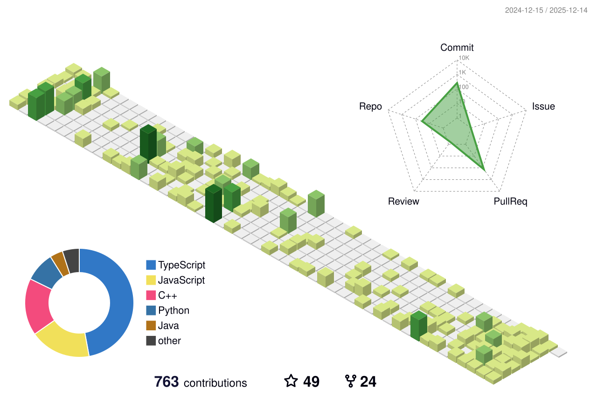

<picture>
  <source srcset="./assets/svg/text-dark.svg" media="(prefers-color-scheme: dark)">
  <source srcset="./assets/svg/text-light.svg" media="(prefers-color-scheme: light)">
  
</picture>

<!-- Content -->
 
 

  🚀 Flutter Enthusiast • 💻 MERN Stack Developer • 🛠 Full-Stack Engineer

  <a href="https://devshayan.github.io/website/" target="_blank">🌐 Portfolio</a> • 
  <a href="mailto:devshayan.dev@gmail.com">📬 Email</a> • 
  <a href="https://linkedin.com/in/devshayan" target="_blank">💼 LinkedIn</a> • 
  <a href="https://github.com/devshayan" target="_blank">🐙 GitHub</a>

---

## 🧠 About Me

I'm a passionate **Flutter Developer** and **MERN Stack Engineer** with over 5 years of experience building clean, scalable, and high-performance applications across mobile and web platforms.

- 🔧 I build apps using Flutter, ReactJS, Node.js, Firebase, MongoDB
- 🚀 I specialize in building **cross-platform apps**, **REST APIs**, and **realtime database solutions**
- 💡 I enjoy crafting smooth UI/UX experiences and solving complex backend challenges
- 💼 Freelancing and collaborating on startups, MVPs, and production-ready products
- 🎯 Currently learning: **Vision AI** for mobile & web integrations

---

## 🔨 Tech Stack

| Frontend | Backend | Mobile | Database | Tools |
|---------|---------|--------|----------|-------|
| React.js, Next.js, TailwindCSS, TypeScript | Node.js, Express.js, Docker | Flutter | Firebase, MongoDB, SQLite | Git, VS Code, Figma, Postman |

---

## 🧩 My Projects

I love building things that solve real-world problems — from polished UIs to powerful backends.

👉 **[View All My Projects Here](https://www.linkedin.com/in/dev-shayan/details/projects/)**  
(Covering Flutter apps, MERN stack websites, Firebase tools, and more!)

---

## 📊 GitHub Stats

  <!-- Streak Dark and Light -->
  <picture>
    <source srcset="https://github-readme-streak-stats-gamma-ten.vercel.app?user=DevShayan&border_radius=0&border=000000&fire=000000&ring=000000&currStreakLabel=000000&background=ffffff" media="(prefers-color-scheme: dark)" width="600">
    <source srcset="https://github-readme-streak-stats-gamma-ten.vercel.app?user=DevShayan&border_radius=0&border=ffffff&fire=ffffff&ring=ffffff&currStreakLabel=ffffff&background=000000" media="(prefers-color-scheme: light)" width="600">
    
  </picture>
  <!-- 3D Dark and Light -->
  <picture>
    <source srcset="./assets/3d-contrib/profile-night-view.svg" media="(prefers-color-scheme: dark)" width="600">
    <source srcset="./assets/3d-contrib/profile-green-animate.svg" media="(prefers-color-scheme: light)" width="600">
    
  </picture>

<!-- https://github-readme-stats.vercel.app/api/top-langs/?username=devshayan&layout=compact&theme=radical -->

<!-- https://github-readme-stats.vercel.app/api?username=DevShayan&show_icons=true&theme=nightowl -->

---

## 🤝 Let's Collaborate!

- Want to build an MVP?
- Need a full-stack mobile/web app?
- Looking for a freelance partner?

📩 Email me at shayanahmed393@gmail.com — I'm open to new opportunities and side projects!

---

> ⭐️ **"Design. Code. Deploy. Repeat."**

